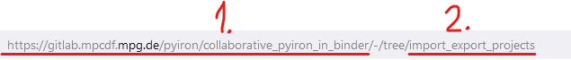
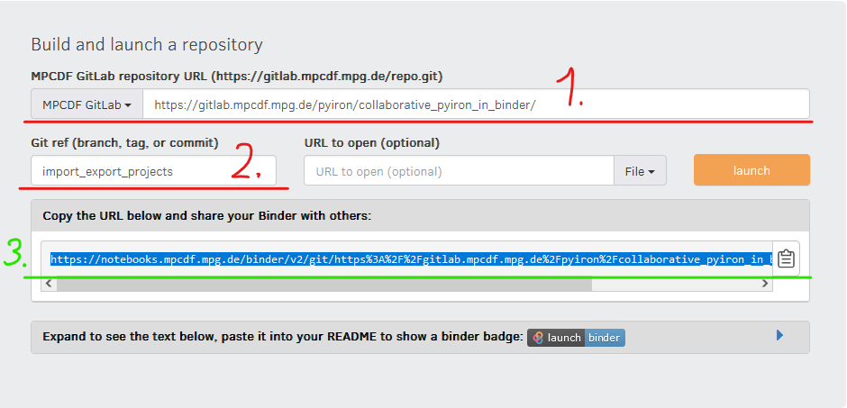

# collaborative_pyiron_in_binder

You can [use this repository as it is](https://notebooks.mpcdf.mpg.de/binder/v2/git/https%3A%2F%2Fgitlab.mpcdf.mpg.de%2Fpyiron%2Fcollaborative_pyiron_in_binder/HEAD) or fork it, for example for specifying the environment and use it with [the binder MPCDF resources](https://notebooks.mpcdf.mpg.de/binder/).

## Instructions



1. the **URL** of the gitlab repository, **without the branch** (required)
1. the **branch** (required for branches except the "main" branch)
1. you can **copy** the created link, if you want to **reuse this repository**
1. click on **launch** to create the instance



## environment specifications
The following packages are specified in the [environment.yml](https://gitlab.mpcdf.mpg.de/vistock/pyiron_in_binder/-/blob/main/environment.yml):

- jupyterlab
- pyiron
- pyiron_base
- lammps
- iprpy-data
- gpaw
- sphinxdft (higher or equal 2.7.0)
- sphinxdft-data
- nglview
- seaborn
- pyscal
- pyiron-data (higher or equal 0.0.5)
- sqsgenerator
- pymatgen
- jupyterlab-link-share
- jupyterlab-lsp
- autopep8
- flake8 (higher or equal 3.8.0)
- pycodestyle (between 2.6.0 and 2.7.0)
- pydocstyle (higher or equal 2.0.0)
- pyflakes (between 2.2.0 and 2.3.0)
- pylint (higher or equal 2.5.0)
- yapf
- rope (higher or equal 0.10.5)

## importing and exporting existing projects
The *import of existing projects* is done autmatically with the shell script [`import_dataset.sh`](import_dataset.sh), under the assumption, there exist exported projects in the `calculation` folder.

The *export of created projects* can be done with the following commands in the notebook:

```python
from pyiron_atomistics import Project
pr = Project("my_calculation")
job = pr.create.job.Lammps(job_name="my_job")
job.structure = pr.create.structure.ase.bulk("my_element")
job.run()
pr.pack(destination_path="save")
```

*Please replace the project name, job name and the element with meaningful Strings.*

